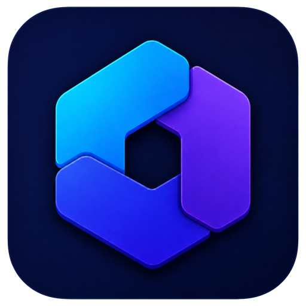
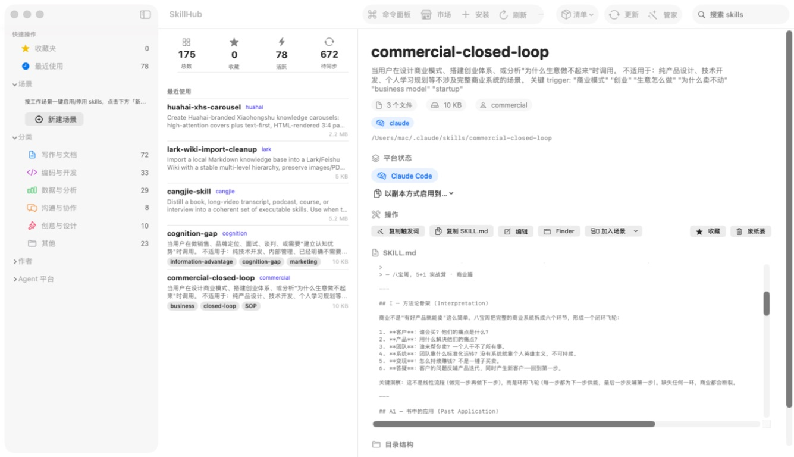
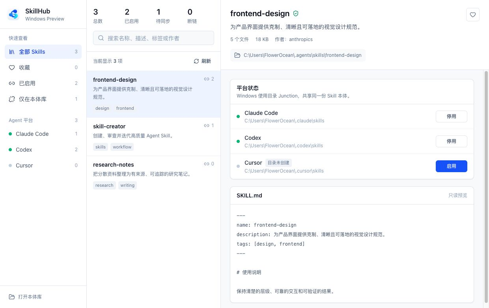
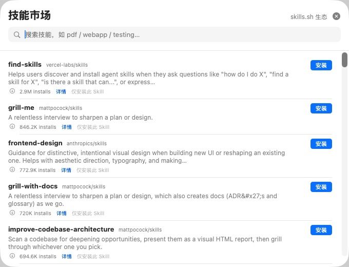

<p align="center">
  
</p>

<h1 align="center">SkillHub</h1>

<p align="center">
  <strong>把散落的 Agent Skills，收进一个清晰、可信、可逆的本体库。</strong>
  <br>
  一款为 Claude Code、Codex 与其他 AI Agent 设计的 macOS / Windows Skills 管理工具。
</p>

<p align="center">
  <a href="https://github.com/0FlowerOcean0/SkillHub/releases/latest"></a>
  <a href="https://github.com/0FlowerOcean0/SkillHub/actions/workflows/ci.yml"></a>
  <a href="https://github.com/0FlowerOcean0/SkillHub/actions/workflows/windows-ci.yml"></a>
  
  
  
  <a href="./LICENSE"></a>
</p>

<p align="center">
  <a href="https://github.com/0FlowerOcean0/SkillHub/releases/download/v1.3.0/SkillHub-1.3.0-macos-universal.dmg"><strong>下载 macOS DMG</strong></a>
  ·
  <a href="https://github.com/0FlowerOcean0/SkillHub/releases/download/windows-v0.1.0/SkillHub_0.1.0_x64-setup.exe"><strong>下载 Windows EXE</strong></a>
  ·
  <a href="https://github.com/0FlowerOcean0/SkillHub/releases/latest">查看最新版本</a>
  ·
  <a href="./CHANGELOG.md">更新日志</a>
</p>

<p align="center">
  <sub>作者：花海 · VX：<code>SeaMinnie</code></sub>
</p>

<p align="center">
  
</p>

<p align="center">
  <sub>真实运行界面 · 原生 macOS 三栏布局</sub>
</p>

<p align="center">
  
</p>

<p align="center">
  <sub>Windows Preview · Tauri + Rust 三栏布局</sub>
</p>

## 一个 skill，只保留一份

Claude Code、Codex、Cursor、Qoder……每个平台都维护自己的 skills 目录。时间一长，同一个 skill 会被复制很多份：版本不同、来源不明、软链接失效，想换机时也不知道该带走哪一份。

SkillHub 只做一件核心的事：将真实本体统一放进 `~/.agents/skills`，再按需链接到各个平台。

```text
~/.agents/skills/your-skill       ← 唯一真实本体
~/.claude/skills/your-skill       → 相对软链接
~/.codex/skills/your-skill        → 相对软链接
其他 Agent/your-skill              → 相对软链接或受控副本
```

Windows 版遵循同一原则，并使用 NTFS Junction 连接各平台目录，不需要管理员权限。

这样一来，更新一次，所有平台同步生效；停用某个平台，只移除链接，不碰本体。

## 把三件事做到极致

<table>
  <tr>
    <td width="33%" valign="top">
      <strong>01 · 看得清</strong><br><br>
      扫描所有平台，解析软链接并按本体去重。哪些已启用、哪些待同步、哪些已经断链，一眼就能看懂。
    </td>
    <td width="33%" valign="top">
      <strong>02 · 装得放心</strong><br><br>
      安装前先冻结来源，再展示规范检查、安全评分、风险明细与完整文件清单。确认后才会写入。
    </td>
    <td width="33%" valign="top">
      <strong>03 · 改得可退</strong><br><br>
      原子安装避免半成品；删除本体优先移入废纸篓；停用只删除链接。关键动作都有清楚的结果反馈。
    </td>
  </tr>
</table>

## macOS 快速开始

1. 下载 [SkillHub 1.3.0 通用版 DMG](https://github.com/0FlowerOcean0/SkillHub/releases/download/v1.3.0/SkillHub-1.3.0-macos-universal.dmg)。
2. 打开 DMG，将 SkillHub 拖入「应用程序」。
3. 首次启动时，右键 SkillHub 并选择「打开」。

> 当前公开 DMG 使用 ad-hoc 签名，尚未接入 Apple 公证，因此 macOS 首次打开时可能显示安全提示。源码、构建脚本与 [SHA-256 校验文件](https://github.com/0FlowerOcean0/SkillHub/releases/download/v1.3.0/SkillHub-1.3.0-macos-universal.dmg.sha256) 均公开可审查。

**运行要求：** macOS 14.0 Sonoma 或更高；DMG 同时支持 Apple Silicon 与 Intel Mac。

## Windows 快速开始

1. 下载 [SkillHub Windows 0.1.0 安装包](https://github.com/0FlowerOcean0/SkillHub/releases/download/windows-v0.1.0/SkillHub_0.1.0_x64-setup.exe)。
2. 运行安装程序；当前使用按用户安装，不需要写入系统级目录。
3. 打开 SkillHub，应用会扫描本体库以及 Claude Code、Codex、Cursor 等常见 Agent 目录。

> Windows 版目前是预览版，聚焦扫描、搜索、Junction 启停、断链识别与 `SKILL.md` 预览。市场、Doctor、Preset、Manifest 等完整能力仍优先使用 macOS 版。安装包目前未购买商业代码签名证书，Windows 首次运行可能显示 SmartScreen 提示。

**运行要求：** 64 位 Windows 10 或 Windows 11，并具备 Microsoft Edge WebView2 Runtime。Windows 源码与构建说明见 [`windows/README.md`](./windows/README.md)。

## 发现、审查，再安装

<table>
  <tr>
    <td width="54%" valign="middle">
      
    </td>
    <td width="46%" valign="middle">
      <strong>接入 skills.sh 生态</strong><br><br>
      浏览热门榜单或搜索具体 skill。点击哪个，就只准备哪个，不会顺手装入同仓库的其他内容。<br><br>
      <strong>支持多种来源</strong><br><br>
      Git 仓库、指定分支或 tag、commit SHA、仓库子目录，以及本地文件夹。
    </td>
  </tr>
</table>

```text
选择来源
   ↓
只读准备与来源冻结
   ↓
规范检查 · 安全扫描 · 文件预览
   ↓
用户确认目标平台
   ↓
原子安装 · 创建链接 · 记录来源与 commit
```

安全扫描覆盖危险删除、远程执行、凭据访问、可疑网络外发与权限提升等规则，并给出 0–100 分和风险明细。它是安装前的辅助判断，不替代人工审查。

## 核心体验

| 模块 | 你可以做什么 |
| --- | --- |
| **统一技能库** | 扫描、去重、启用、停用、收藏、搜索，并清楚看到每个平台的实际状态 |
| **场景 Preset** | 将一组 skills 保存为“前端开发”“内容创作”等场景，再一键激活或停用 |
| **技能市场** | 浏览 skills.sh 热门榜单、关键词搜索、查看安装量，并只安装选中的 skill |
| **安装审查** | 检查 frontmatter、文件清单、安全风险、来源 ref 与实际 commit 后再安装 |
| **体检 Doctor** | 发现断链、重名、缺少描述、引用缺失、异常体积、孤儿本体与安全问题 |
| **智能管家** | 收编散落本体、清理冗余、梳理来源，并用废纸篓保护可恢复的数据 |
| **清单 Manifest** | 导出 skills、来源、标签和启用平台；换机或团队共享时先预览再恢复 |
| **项目工作区** | 管理项目级 `.claude/skills`、`.agents/skills`，与全局本体库双向同步 |
| **Git 更新** | fetch 后对比本地与远端 commit，有更新时明确提示，再由你决定是否 pull |
| **命令面板** | 使用 ⌘K 快速搜索和执行常用动作，减少在多个页面之间来回切换 |

## 安全边界

SkillHub 会读写你授权管理的 skills 目录，因此对“删除”和“更新”保持克制：

- 停用只移除平台链接，不删除 `~/.agents/skills` 中的本体。
- 删除本体和同名冲突清理优先移入 macOS 废纸篓，保留恢复机会。
- 安装使用临时目录准备并原子落盘，避免网络中断留下半成品。
- 第三方 skill 在写入前展示安全扫描与文件清单，高风险项需要额外确认。
- Git 更新不会替你处理本地未提交改动；执行前请先确认仓库状态。
- 部分体检修复会直接改名或补写 frontmatter，重要资料建议先备份。

完整说明见 [安全策略](./SECURITY.md) 与 [隐私说明](./PRIVACY.md)。

## 从源码运行

项目使用 SwiftUI 与 Swift Package Manager，无第三方 Swift 依赖。

```bash
# Debug 构建并运行
swift build
swift run

# 运行测试
swift test

# 生成标准 macOS App Bundle
Scripts/make_app.sh
open .build/app/SkillHub.app
```

<details>
<summary><strong>通用构建、签名与本地安装</strong></summary>

<br>

```bash
# 构建 Apple Silicon + Intel 通用版本
UNIVERSAL=1 Scripts/make_app.sh

# 构建、安装到 /Applications 并启动
Scripts/install_app.sh

# Developer ID 签名、公证与发布归档
SIGN_IDENTITY="Developer ID Application: Your Name (TEAMID)" \
NOTARY_PROFILE="skillhub-notary" \
Scripts/release_app.sh
```

`make_app.sh` 默认使用 ad-hoc 签名，适合本机测试。正式公开分发需要有效的 Developer ID 证书和 notarytool profile，证书与凭据不得提交到仓库。

</details>

<details>
<summary><strong>Skills 目录与数据约定</strong></summary>

<br>

- 包含 `SKILL.md` 的目录才会被识别为 skill。
- 推荐使用 YAML frontmatter，SkillHub 会读取 `name`、`description`、`version`、`tags`、`summary` 与 `author`。
- 安装来源记录在 `~/.agents/.skill-lock.json`，用于来源追踪、Manifest 和版本更新。
- 收藏、场景、自定义平台、扫描目录与项目工作区等偏好存放在 macOS UserDefaults。
- 副本模式会写入 `.skillhub-copy` 标记，用来区分受控副本与真实本体。

</details>

## 文档与贡献

- [贡献指南](./CONTRIBUTING.md) — 本地开发、分支与提交约定
- [安全策略](./SECURITY.md) — 如何私下报告安全问题
- [隐私说明](./PRIVACY.md) — 本地数据与网络访问边界
- [更新日志](./CHANGELOG.md) — 每个版本的变化
- [竞品分析](./docs/competitive-analysis.md) — 产品定位与设计取舍

欢迎提交 Issue、改进文档或贡献代码。开始前建议先阅读 [CONTRIBUTING.md](./CONTRIBUTING.md)。

## 作者

**花海**

- VX（微信）：`SeaMinnie`
- GitHub：[@0FlowerOcean0](https://github.com/0FlowerOcean0)

如果 SkillHub 让你的 Agent 工作流变得更清楚，欢迎点一个 Star，也欢迎把真实使用中的问题告诉我。

## License

代码使用 [MIT License](./LICENSE)。SkillHub 名称与 Logo 用于标识官方发行版本，不因源码许可证而授权他人冒充官方产品。
